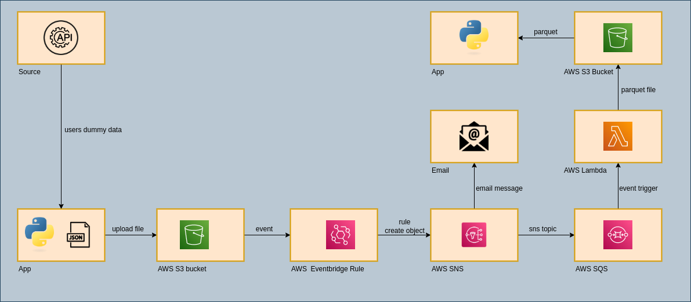

# Aws event driven data processing
> This application showed connection in aws services and return event when user make any changes in files.

## Table of Contents
* [General Info](#general-information)
* [Technologies Used](#technologies-used)
* [Features](#features)
* [Screenshots](#screenshots)
* [Setup](#setup)
* [Usage](#usage)
* [Project Status](#project-status)
* [Room for Improvement](#room-for-improvement)

## General Information
- This project was created because I wanted run project in aws services.
- I wanted to create application with notifications and queue solution.

## Technologies Used
- Python - version 3.10.6

## Features
List the ready features here:
- Create a user in IAM console,
- Create an S3 bucket, 
- Create a policy and add it to user,
- Create connection with external API and get dummy data for user in json file,
- Upload json file into AWS S3 bucket

## Screenshots

## Setup

## Project Status
Project is: in_progress

## Room for Improvement

To do:
- Creation eventbridge rules,
- Creation sns notification,
- Creation sqs connection,
- Creation Lambda,
- Connection with S3 bucket from lambda